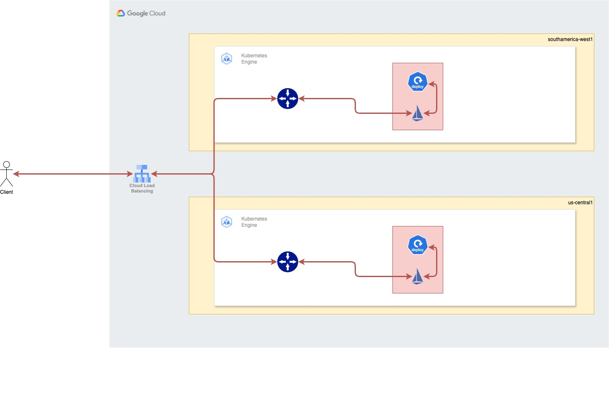

# Setting up Multi-cluster Ingress with Anthos Service Mesh

The following set of instructions explain how to set up a Multi-Cluster Mesh using Anthos Service Mesh (ASM)

## Architecture

The following diagram shows end goal of configuration



The configuration will allow an external global application load balancer, enter the application served inside two regional clusters, via an ingress gateway which later will be routed to an envoy proxy embedded inside Istio Side Car, injected inside the deployment pod. 

For mode details on how this works, refer to the following [video](https://www.youtube.com/watch?v=UuFR_FztLK0) 


## Instructions

1. Open Cloud Shell and set up the following variables in as much terminals you will use. 

```shell
export PROJECT_ID=$(gcloud config get-value project)
export CLUSTER_NAME_SA="cluster-santiago"
export CLUSTER_NAME_IOWA="cluster-iowa"
export REGION_SA="southamerica-west1"
export REGION_IOWA="us-central1"
export SUBNET_SA="custom-subnet-santiago"
export SUBNET_IOWA="custom-subnet-iowa"
```

Adjust the variables to whatever applies to your case. In this case, the setup is two clusters, one located in southamerica-west1 and the other in us-central1. 

2. Create the clusters if not already done. Notice that in order for clusters to properly support ASM, they need to have `enable-ip-alias-enabled`


**Santiago Cluster**
```shell
gcloud container clusters create $CLUSTER_NAME_SA \
    --region $REGION_SA \
    --enable-ip-alias \
    --network "projects/$PROJECT_ID/global/networks/my-custom-vpc" \
    --subnetwork $SUBNET_SA \
    --machine-type "e2-medium" \
    --num-nodes 2 \
    --workload-pool="$PROJECT_ID.svc.id.goog"
```


**Iowa Cluster**

```shell
gcloud container clusters create $CLUSTER_NAME_IOWA \
    --region $REGION_IOWA \
    --enable-ip-alias \
    --network "projects/$PROJECT_ID/global/networks/my-custom-vpc" \
    --subnetwork $SUBNET_IOWA \
    --machine-type "e2-medium" \
    --num-nodes 2 \
    --workload-pool="$PROJECT_ID.svc.id.goog"
```

3. Get credentials for both clusters

```shell
gcloud container clusters get-credentials $CLUSTER_NAME_SA --region $REGION_SA
gcloud container clusters get-credentials $CLUSTER_NAME_IOWA --region $REGION_IOWA
```

4. If not already installed on your local terminal, insstall Anthos Service Mesh CLI (asmcli)

```shell
curl https://storage.googleapis.com/csm-artifacts/asm/asmcli > asmcli
chmod +x asmcli
sudo mv asmcli /usr/bin
```

5. Enable Workload Identity on both clusters

```shell
gcloud container clusters update $CLUSTER_NAME_SA --region $REGION_SA --workload-pool="$PROJECT_ID.svc.id.goog"
gcloud container clusters update $CLUSTER_NAME_IOWA --region $REGION_IOWA --workload-pool="$PROJECT_ID.svc.id.goog"
```

6. Register Clusters with fleet

```shell
gcloud container fleet memberships register $CLUSTER_NAME_SA \
    --gke-cluster=$REGION_SA/$CLUSTER_NAME_SA \
    --enable-workload-identity
```

```shell
gcloud container fleet memberships register $CLUSTER_NAME_IOWA \
    --gke-cluster=$REGION_IOWA/$CLUSTER_NAME_IOWA \
    --enable-workload-identity
```

7. Install Anthos Service Mesh in both clusters

```shell
asmcli install \
    --project_id $PROJECT_ID \
    --cluster_name $CLUSTER_NAME_SA \
    --cluster_location $REGION_SA \
    --fleet_id $PROJECT_ID \
    --output_dir ./asm-output \
    --enable_all \
    --ca mesh_ca \
    --enable_gcp_components \
    --option legacy-default-ingressgateway 
```

```shell
asmcli install \
    --project_id $PROJECT_ID \
    --cluster_name $CLUSTER_NAME_IOWA \
    --cluster_location $REGION_IOWA \
    --fleet_id $PROJECT_ID \
    --output_dir ./asm-output \
    --enable_all \
    --ca mesh_ca \
    --enable_gcp_components \
    --option legacy-default-ingressgateway
```

8. Enable Istio Proxy Sidecar Injection on monitored namespaces (in this case `default` namespace)

```shell
kubectl label namespace default istio-injection=enabled --context=gke_${PROJECT_ID}_${REGION_SA}_${CLUSTER_NAME_SA}
```

```shell
kubectl label namespace default istio-injection=enabled --context=gke_${PROJECT_ID}_${REGION_IOWA}_${CLUSTER_NAME_IOWA}
```

9. This repository contains a sample application. In order to deploy it, execute the script `deploy.sh``

```shell
./deploy.sh
```

10. reate namespace for istio-gateway

```shell
kubectl create namespace istio-gateway --context=gke_${PROJECT_ID}_${REGION_SA}_${CLUSTER_NAME_SA}
```

```shell
kubectl create namespace istio-gateway --context=gke_${PROJECT_ID}_${REGION_IOWA}_${CLUSTER_NAME_IOWA}
```

11. Deploy Gateway and Virtual Service Configurations on both clusters, to link up application to ingress gateway

```shell
kubectl apply -f istio/app-gateway.yaml --context=gke_${PROJECT_ID}_${REGION_SA}_${CLUSTER_NAME_SA}
```

```shell
kubectl apply -f istio/app-gateway.yaml --context=gke_${PROJECT_ID}_${REGION_IOWA}_${CLUSTER_NAME_IOWA}
```

12. At this point, you should have two public entry points, related to ingress gateways, one per cluster. You can directly test the applications going to these endpoints. If you need to have a single entry point for both clusters, then patch the istio-ingress gateways to become NEGs

```shell
kubectl patch svc istio-ingressgateway -n istio-system --context=gke_${PROJECT_ID}_${REGION_SA}_${CLUSTER_NAME_SA} -p \
'{"spec": {"type": "NodePort"}, "metadata": {"annotations": {"cloud.google.com/neg": "{\"exposed_ports\":{\"80\":{\"name\": \"istio-http-santiago\"}}}"}}}'
```

```shell
kubectl patch svc istio-ingressgateway -n istio-system --context=gke_${PROJECT_ID}_${REGION_IOWA}_${CLUSTER_NAME_IOWA} -p \
'{"spec": {"type": "NodePort"}, "metadata": {"annotations": {"cloud.google.com/neg": "{\"exposed_ports\":{\"80\":{\"name\": \"istio-http-iowa\"}}}"}}}'
```

**NOTE**

In case patching to Load Balancer back is required, use: 

```shell
kubectl patch svc istio-ingressgateway -n istio-system --context=gke_${PROJECT_ID}_${REGION_SA}_${CLUSTER_NAME_SA} -p '{"spec": {"type": "LoadBalancer"}}'
kubectl patch svc istio-ingressgateway -n istio-system --context=gke_${PROJECT_ID}_${REGION_IOWA}_${CLUSTER_NAME_IOWA} -p '{"spec": {"type": "LoadBalancer"}}'
```

13. Create Healthcheck

```shell
gcloud compute health-checks create http istio-health-check \
    --port 15021
```

14. Update the URI of the healthcheck

```shell
gcloud compute health-checks update http istio-health-check \
    --request-path="/healthz/ready"
```

15. Create Firewall Rule

```shell
gcloud compute firewall-rules create allow-istio-health-check \
    --network=my-custom-vpc \
    --allow=tcp:15021,tcp:15020,tcp:31859,tcp:32080,tcp:31314 \
    --source-ranges=0.0.0.0/0,130.211.0.0/22,35.191.0.0/16 \
    --target-tags=all
```

16. At this point, follow [this link](https://medium.com/niveus-solutions/deploying-anthos-service-mesh-on-private-gke-and-configuring-asm-with-cloud-load-balancing-e47d76c98978 ) to create an Application Load Balancer to connect the NEGs


**NOTE**

If issues arises with 404 on front end, check the routing on istio, by using: 

```shell
istioctl proxy-config routes <istio-ingressgateway-pod-name> --context=gke_${PROJECT_ID}_${REGION_XX}_${CLUSTER_NAME_XX} -n istio-system

```

If you need to check the NEG Healthcheck run: 

```shell
gcloud compute backend-services get-health istio-backend --global
```
